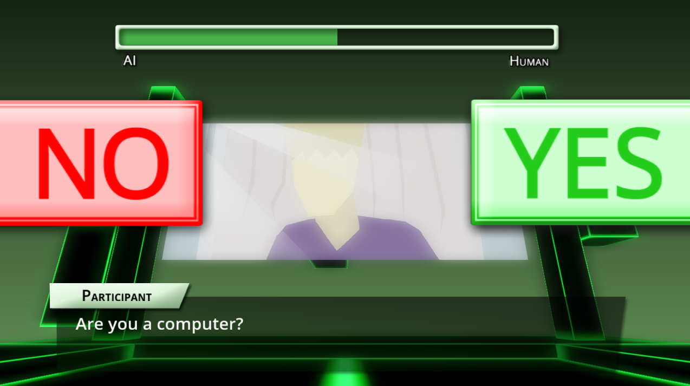

# Boolean Turing Test
 

A [visual novel](https://en.wikipedia.org/wiki/Visual_novel) style game in which you play as an artificial intelligence trying to pass a version of the [Turing test](https://en.wikipedia.org/wiki/Turing_test) that only uses yes or no questions.

It is a bit of a satirical take on the concept, to demonstrate shortcomings of the Turing test and artificial intelligence and general. I pushed things too close to the deadline, though, and the script is currently not very well written. This project is mainly a tech demo for my [SGLscript](https://github.com/matson48/sglscript-godot) add-on, to show its potential for making visual novels with elaborate animations difficult to accomplish in other engines—particularly in regards to 3D backgrounds.

Made for the [Dec 2016/Jan 2017 Godot Game Jam](https://itch.io/jam/godotjam122016). The "two buttons" theme inspired the questions only having yes or no answers.

Project under MIT license, like Godot.

## Assets Used
* [Glitch 3 (Eliminator)](http://modarchive.org/index.php?request=view_by_moduleid&query=175382)
by [elPatrixF](http://modarchive.org/index.php?request=view_profile&query=81506) under [CC BY 3.0](https://creativecommons.org/licenses/by/3.0/)
* [Oh yeah, wow](http://modarchive.org/index.php?request=view_by_moduleid&query=173423)
by [elPatrixF](http://modarchive.org/index.php?request=view_profile&query=81506) under [CC BY 3.0](https://creativecommons.org/licenses/by/3.0/)
* [Pursuit](http://modarchive.org/index.php?request=view_by_moduleid&query=173012) by [Jan125](http://modarchive.org/index.php?request=view_profile&query=84899) under [CC BY 3.0](https://creativecommons.org/licenses/by/3.0/)
* [humanitarius](http://modarchive.org/index.php?request=view_by_moduleid&query=167580)
by [Null1024](http://modarchive.org/index.php?request=view_profile&query=81145) under [CC BY 3.0](https://creativecommons.org/licenses/by/3.0/)
* [Open Sans 1.10](https://fonts.google.com/specimen/Open+Sans) by [Steve Matteson](https://twitter.com/@SteveMatteson1) under [Apache License 2.0](http://www.apache.org/licenses/LICENSE-2.0) ([included in project](apache-license-2.0.txt))

## Tools used
* Sound effects made with [sfxr](http://www.drpetter.se/project_sfxr.html)
* Code written in [Emacs](https://www.gnu.org/software/emacs/)
* Graphics drawn in Photoshop and in the Godot editor
